# 🎓 Sivert Utne - Computer Science Student

I am currently on the first year of my 2-year Master's Degree in Computer Science. From before i have a Bachelor as a computer engineer.

## What Courses have i taken?
> Note that because of restrictions in the courses i am currently taking i am not able to make my "University" repository public at this point in time. This repository contains every single assignment, project and coding exam i have produces as a part of my University Education. I have instead listed all the courses and comprised a few (visual) highlights of some of the work from that repository below:

### Courses as part of my Master's Degree

TDT4136 - Introduction to Atrificial Intelligence

The subject starts with a description of problem solving methods by means of heuristic search. Therafter, various knowledge representation languages and inference methods for automatic problem solving. Representation in form of predicate logic, frames and semantic nets are treated, and connected to the main forms of reasoning - especially rule based reasoning. Furthermore, architectures that integrates various resoning methods, agent based architectures and architectures for interactive problem solving. Numerous applicaton examples are given to demonstrate the methods.

 

TDT4195 - Visual Computing Fundamentals

Half of the course is concerned with image syntesis (computer graphics) and half of the course is on image analysis (image processing).

Graphics
graphical primitives, rasterization, anti-aliasing, clipping, geometric transformations, viewing transformations, hierarchical scene modelling, culling and hidden surface elimination, colour representation, illumination models and algorithms. C/C++ OpenGL labs.

Image processing
introduction to and examples of image processing and simple image analysis applications. Intro to deep learning based image interpretation and understanding (fully-connected neural networks and CNNs). Filtering and image enhancement in both the spatial domain as well as in the frequency / Fourier domain. Various image segmentation methods and mathematical morphology. Labs with assignments and Python (alternatively MATLAB).

 

TDT4200 - Paralell Computing

Optimizing algorithms for both single and multi-processors systems as well as accellerators such as GPUs. Choosing numerical algoriths, use of optimized libraries, compiler optimizations and program profiling. How to take advantage of PC-clusters and graphics cards for computationally large tasks which cannot be run on a single processor system will also be covered. The course includes parallel programming asignments.

 

TDT4287 - Algorithms for Bioinformatics

The course deals with algorithms with applications in bioinformatics, with a particular focus on algorithms and data structures for search, comparisons, and motif discovery in strings. The course uses biological examples to motivate algorithms and solutions, but the course's focus is on the algorithmic problems and solutions.

 

### Courses as Part of my Bachelor's Degree

- TDAT3001 - Bachelor 
- TDAT3002 - Systemplaning with Economy
- TDAT3025 - Applied MAchine Learning
- TDAT3024 - Mathemathics and Physics
- IINI4014 - Python for programmers
- IINI4003 - C++ for programmers
- IINI4001 - Application development for Android
- TDAT2004 - Computer communication with netwrok programming
- TDAT2005 - System development 2 with web-applications
- TDAT2005 - Algorithms and Datastructures
- TDAT2002 - Mathemathics 2
- TDAT2001 - Science for computer engineers
- TDAT1006 - System devevlopment
- TDAT1005 - Databases with advanced programming
- TDAT1007 - Introduction to engineering
- TDAT1004 - Mathemathics 1
- TDAT1003 - Computertechnology and Operating Systems
- TDAT1001 - Introduction to Programming

## Some highlights

#### Paralell Computing

Image morphing using multiple processes with OpenMPI.

#### Introduction to artificial intelligence

Visualization of A* algorithm checking tiles while looking for the shortest path:

#### Bachelor

Cross-plattform mobile application to order pickup of waste. Developed with Flutter amd includes:
- SMS-verification
- Captcha-verification
- Use of device location
- Live updating data from database
- Dark Mode
- and more...

  
  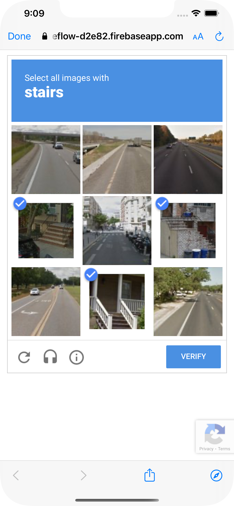
  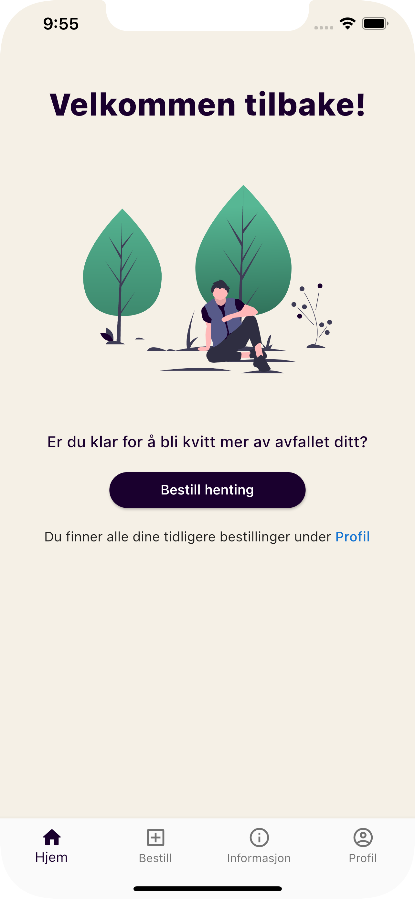
  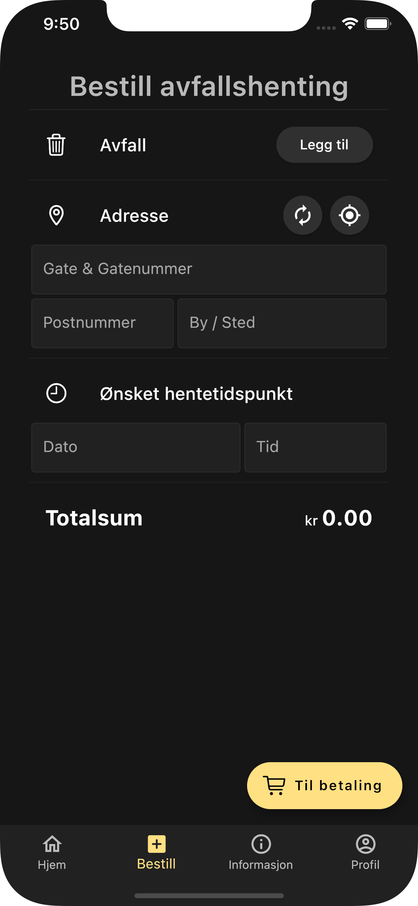
  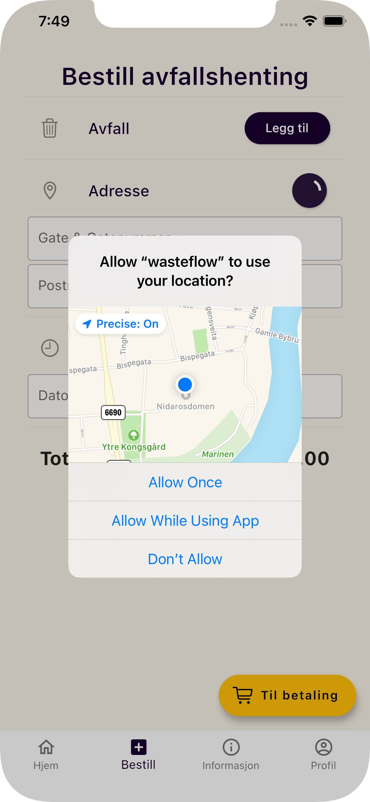
  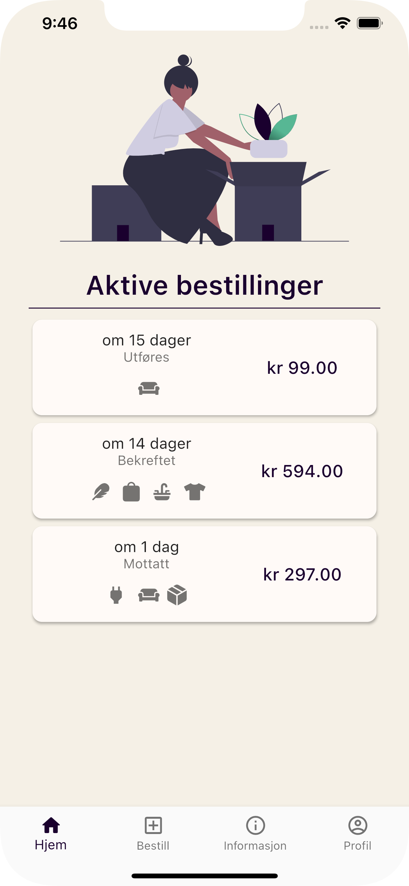
  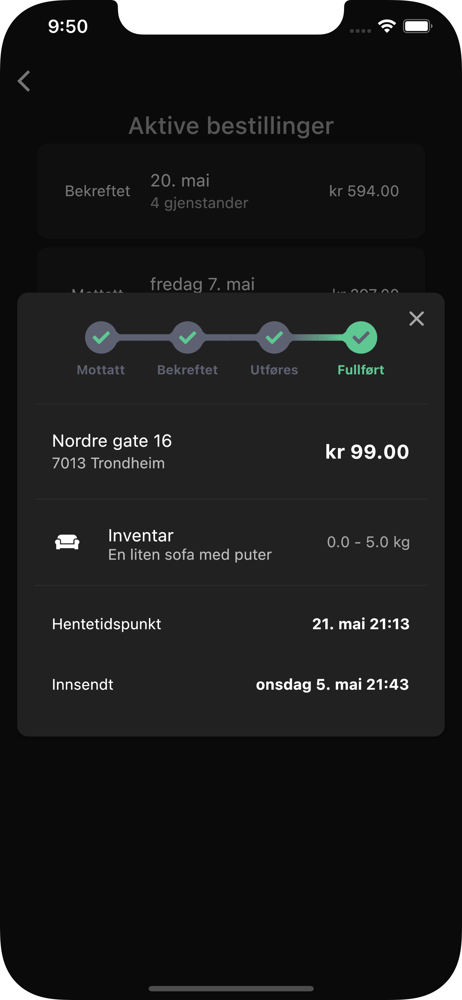
  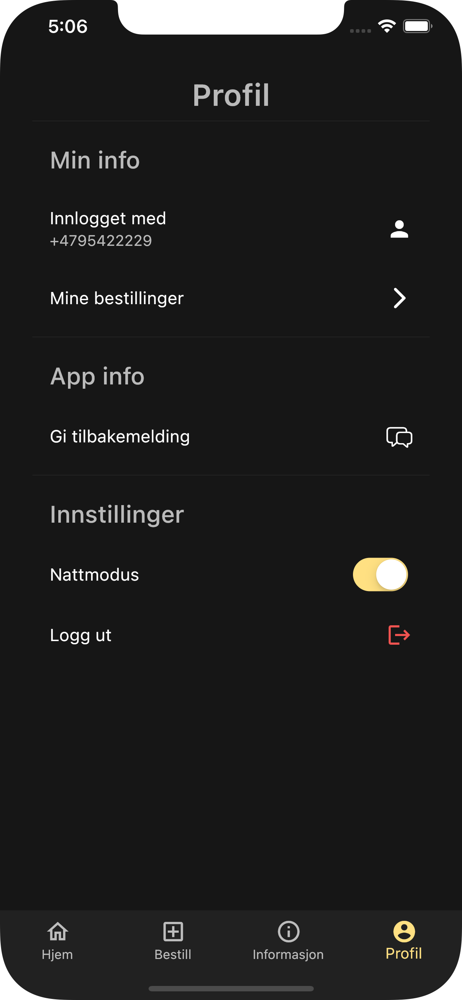

#### Applied Machine Learning

Visualizing of numer recognition after different amount of epochs.

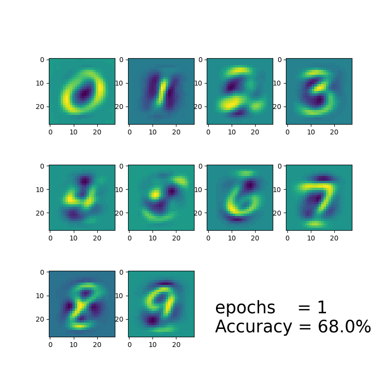

Pacman i created from scratch in PyGame as part of a project:

#### C++ for programmers

Physics based ball-throwing game in OpenGL

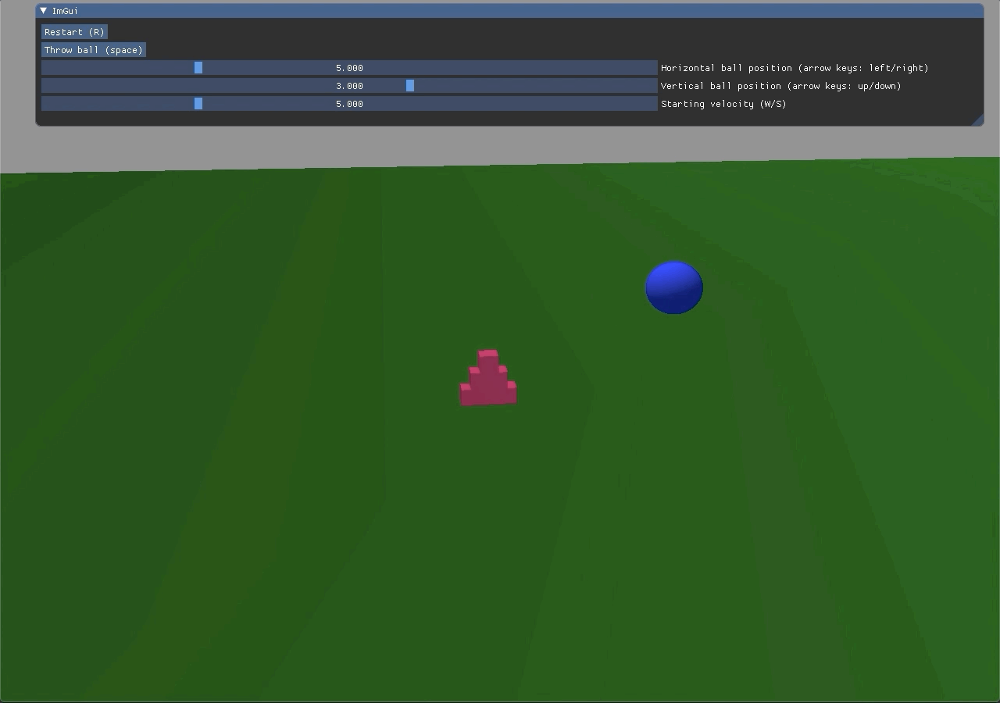
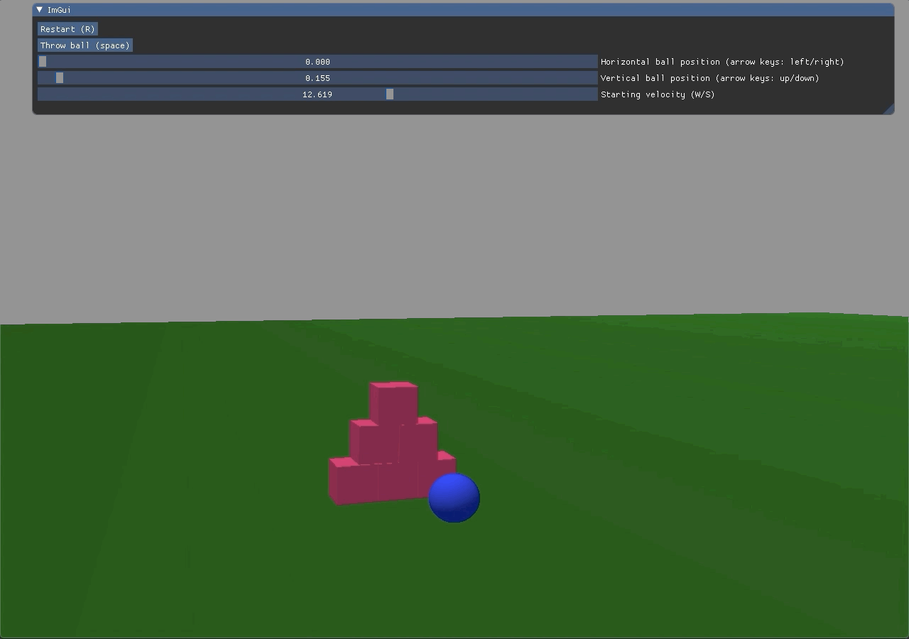

#### Python for programmers

Just looks pretty (was a turtle introduction assignment)

#### Computer communication with Network programming

Live "multiplayer" drawing application

#### Introduction to programming

Demonstration of transformations and rotations in OpenGL, where i created Steve from Minecraft.

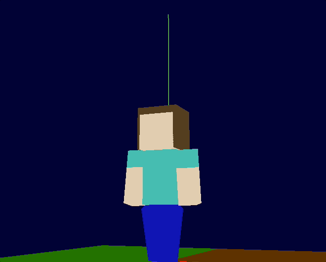
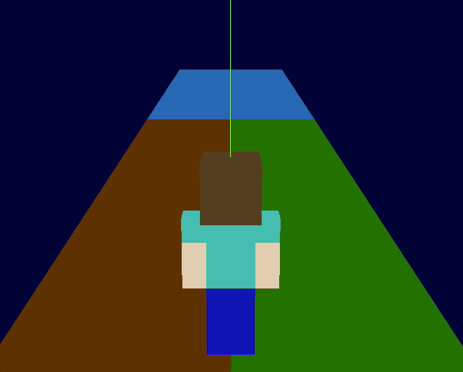
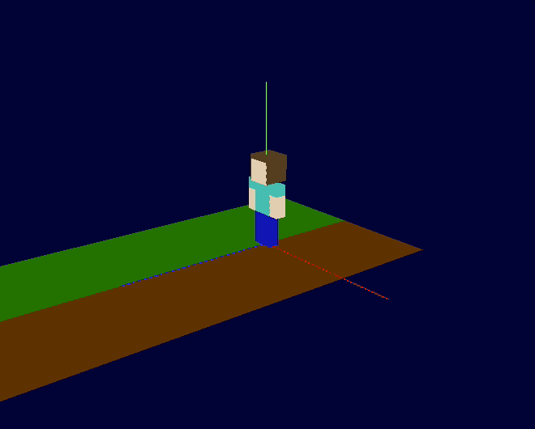

<!--

-->

<!--
###  Tools and frameworks

   

   
-->

<!--
### IDEs

 
-->

<!-- ### Operating system

 

### Learn more about me  👋🏻

[][website]
[][linkedin]
[][instagram]  
 
 
 

  
📈 My Github Stats

   
  

  

 -->

<!-- [website]: https://folk.ntnu.no/sivertut -->
[instagram]: https://instagram.com/sivertutne
[linkedin]: https://linkedin.com/in/sivert-utne
